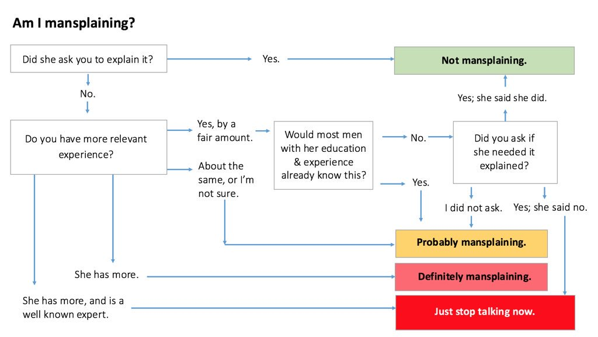

This project was created not to be 'production ready' at Enterprise standard, but instead be a fun and interactive project that can also be used to learn together on stream. 

Genuine bugs may happen and these are appreciated, but your opinion of how the code could be written differently or 'better' is not a bug.

Before submitting a bug request, please follow the questions in this chart:



If you hit the 'Not mansplaining' box then please continue ❤

## Environment data

- OS:
- Browser Version:
- [any additional info]

## Expected behaviour

[add notes here]

## Actual behaviour

[add notes here]

## Logs

```
Add any error messages or logs here that might help trace out the issue. A useful place to look is in the Developer Console which can be found in the Developer Tools window. On most common browsers, this can be accessed with the shortcut F12 
```

## Code Snippet / Additional information

<!-- If you know the code that's causing it or the code that might fix it, include it here -->

```
add.code.here();
```


